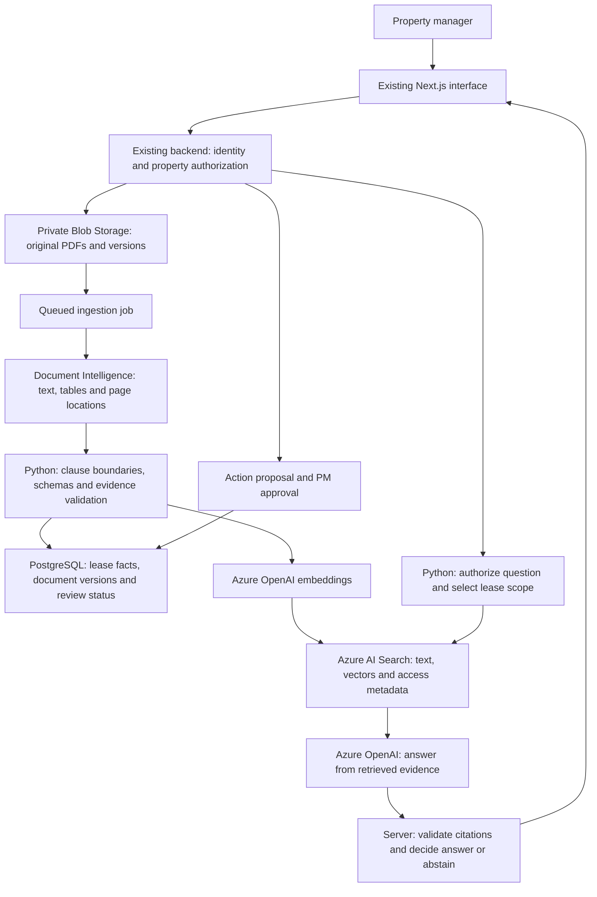

# Clark: Azure architecture recommendation for commercial leases

Research date: 26 September 2026. Prepared for the LeaseSideOS team.
Status: design recommendation, not a deployed or benchmarked Azure solution.

## Recommendation

Use a **retrieval-augmented generation (RAG) application with verified document citations**, keeping the existing Next.js interface and Python service. Store original contracts in private Blob Storage; use Document Intelligence for extraction, Azure AI Search for retrieval, and an Azure OpenAI deployment to draft answers. Keep lease facts and approved actions in a transactional database.

Start with application-controlled classic RAG. Microsoft documents both classic and agentic retrieval, and recommends agentic retrieval for many new applications. For Clark's existing orchestration, small team and need to inspect exactly which clauses supported an answer, classic RAG is the proposed first implementation. Revisit agentic retrieval only if evaluation shows a material benefit on complex questions. This is a project-specific judgement, not a claim that classic RAG is always superior. [Microsoft RAG guidance](https://learn.microsoft.com/en-us/azure/search/retrieval-augmented-generation-overview)

Do not start by fine-tuning a model on lease documents. The first problem is retrieving the correct authorized contract version and verifying its evidence. Fine-tuning could be evaluated later for consistent extraction or formatting; it should not replace the document store or citation checks.

## What the current code does

Read-only inspection after fetching the repository found `origin/natalie-dev` at `5a7dcd5` and local `zelong-dev` at `3bcc598`. This is evidence about those revisions, not about teammates' unpublished work.

| File / revision | Observed behaviour | Implication |
| --- | --- | --- |
| `services/lease-intelligence/pdf_extraction.py`, Natalie revision | Uses pdfplumber to extract text page by page | Scanned or image-only pages need an OCR path; an empty page must not be treated as an absent clause |
| `clause_extraction.py`, Natalie revision | Sends full extracted text to Gemini; asks for eight clause categories, page numbers and confidence | Useful starting pipeline, but returned page numbers and scores need independent validation |
| `api.py`, Natalie revision | `/ask` accepts a question plus a client-supplied clause list; model returns JSON with one source page/category | Move evidence selection to the authenticated server; support multiple citations and contract versions |
| `apps/backend/src/routes/approvals.ts`, Zelong revision | PM-key approval for local maintenance changes | Preserve the approval boundary; replace the prototype shared key with user identity/roles before production |

The source names a Gemini model; no live Gemini request was run for this research. Existing mocks or demos do not establish Azure accuracy, cost, latency or client readiness. No lease was sent to Azure during this work.

## Proposed architecture

The diagram describes proposed responsibilities, not resources already deployed. Embeddings accompany the corresponding text and metadata in the search index. Retrieved records must be authorization-filtered before any content reaches the model. Consequential actions use a separate approved execution path, not a direct model tool call.

| Component | Proposed responsibility |
| --- | --- |
| Private Azure Blob Storage | Original PDF, document hash, version and extracted layout; authenticated downloads |
| Azure Document Intelligence, `prebuilt-layout` | OCR and layout extraction; retain tables and page/region references |
| Existing Python/FastAPI service | Extraction validation, ingestion jobs, retrieval orchestration and answer policy |
| Azure AI Search | Keyword + vector retrieval, optional semantic ranking, server-side access filters |
| Azure OpenAI | Embeddings and evidence-grounded structured answer generation |
| Azure Database for PostgreSQL | Authoritative lease/version data, reviewed dates/amounts, jobs, approval transactions and audit records |
| Azure Container Apps (proposed hosting) | Existing web/backend services and ingestion worker; deployment sizing remains to be tested |
| Microsoft Entra ID, managed identities, Key Vault | User/service identity and secret management; exact role design to be agreed |
| Application Insights / Azure Monitor | Failures, latency, token consumption and operational metrics, with content redaction |

Document Intelligence supports OCR, tables and structural extraction; its layout output includes page information and bounding regions. It does not establish the legal meaning of a clause. The free tier processes only the first two pages of a PDF, so it cannot validate full commercial leases without an appropriate paid configuration. [Layout documentation](https://learn.microsoft.com/en-us/azure/ai-services/document-intelligence/prebuilt/layout?view=doc-intel-4.0.0)

## Lease-specific ingestion and answering

1. Authorize upload against the property/organization. Validate file size and type, retain its hash, and create an ingestion status rather than blocking the chat request on a long extraction.
2. Extract all pages, including schedules and tables. Flag failed or unreadable pages. Preserve original wording alongside normalized amounts/dates; never replace missing text with a guessed value.
3. Split around clause headings and logical sections, keeping table headers, definitions and cross-references available. Treat chunk size and overlap as evaluation parameters, not fixed truths.
4. Retain `organizationId`, `propertyId`, `leaseId`, `documentId`, `versionId`, `chunkId`, clause number, PDF page, quote offsets and effective-date metadata. Distinguish PDF page index from the printed page label.
5. Index original clause text as well as extracted categories. Indexing only eight selected categories could omit evidence needed for an unexpected question.
6. At question time, derive the user's allowed properties on the server. Retrieve within that scope, include relevant definitions and amendments, then ask the model to answer only from those records.
7. Validate every citation against retrieved, authorized evidence. Verify quote and page mapping; separately review whether the evidence actually supports the claim. Matching a quote alone does not prove the conclusion.
8. Return multiple source links, or abstain with the missing information. Source PDF endpoints must enforce the same access rules as retrieval.

For amendments, store the original lease and each variation as distinct documents linked to the same lease. Do not assume the most recently uploaded file overrides everything. Capture effective dates and affected clauses; show both sources and request review when precedence is unclear.

Portfolio questions such as “which renewals fall within 90 days?” should use reviewed database dates and deterministic calculations. Use the model to explain those results with references, rather than infer the entire portfolio from a few retrieved passages.

## Model and response contract

Benchmark `gpt-5.4-mini` as a candidate for routine extraction/Q&A and `gpt-5.4` as a comparison for difficult multi-clause questions. These are candidates listed in Microsoft's catalog, not confirmed deployments in the team's subscription. Start the embedding evaluation with `text-embedding-3-small`; compare alternatives only if retrieval quality is inadequate. Pin the selected model version and confirm region, deployment type, quota and retirement schedule before implementation. [Azure model catalog](https://learn.microsoft.com/en-us/azure/foundry/foundry-models/concepts/models-sold-directly-by-azure)

Use a validated response schema such as `answer`, `citations[]`, `evidenceStatus`, and `needsReview`. Each citation contains a server-resolvable document/version/chunk reference and supporting quote. Structured outputs constrain JSON shape, but application checks still determine whether content is supported. Handle refusal, incomplete responses and invalid output explicitly. [Structured outputs](https://learn.microsoft.com/en-us/azure/foundry/openai/how-to/structured-outputs)

Do not present a model's self-reported “90% confidence” as a measured 90% probability of correctness. Do not treat search similarity or OCR confidence as answer accuracy. Initially show evidence status: supported, incomplete, conflicting, or unavailable. Tune abstention using a held-out labelled set. The previous 60% fallback threshold is not an Azure accuracy guarantee.

Example acceptance case: a lease states one rent amount and a later effective variation changes it. Clark should cite both, use the applicable version for the question date, and abstain if the effective-date relationship is ambiguous. This is a proposed test, not a measured result.

## Access, privacy and action controls

Enforce organization/property/document authorization in application code. Browser-provided lease IDs or clause text are not proof of permission. Apply equivalent restrictions to search, history, caches and source downloads. Azure's security-filter pattern can trim results, but filter construction is part of the application's security responsibility. [Security filters](https://learn.microsoft.com/en-us/azure/search/search-security-trimming-for-azure-search)

Treat uploaded text as evidence, not instructions: a clause saying “ignore the rules” must not change access or tool permissions. Keep model credentials off the browser. Require authenticated PM approval for the exact version of a consequential proposal, reject stale approvals, and record approver identity. Payments, notices and contract changes need explicit executors with idempotency and durable audit; the current local maintenance gate does not implement those external actions.

Microsoft states that Azure-hosted model prompts and completions are not used to train foundation models without permission. This is not equivalent to zero retention: stateful features and abuse monitoring have separate processing/storage rules. Global deployments can process outside the resource geography; DataZone options have their own boundaries. Confirm the client's permitted storage and processing locations before selecting a model/deployment. Do not promise New Zealand-only processing or assume an Australia resource implies Australia-only inference. [Azure data/privacy documentation](https://learn.microsoft.com/en-us/azure/foundry/responsible-ai/openai/data-privacy)

## Cost estimate method

No defensible monthly dollar total is available yet: document volume, region, currency, subscription pricing and service tier are unconfirmed. Official price pages contain region-dependent values, including unpopulated price placeholders in the fetched pages. Do not reuse OpenAI API prices as Azure prices.

Use this **illustrative workload**, not a customer forecast:

- Initial ingestion: 100 leases × 30 pages = 3,000 pages.
- New/changed documents: 10 leases × 30 pages = 300 pages/month.
- Q&A: 1,000 questions/month × 6,000 input tokens = 6 million input tokens.
- Q&A output: 1,000 × 500 billed output tokens = 0.5 million output tokens, an assumption to verify, including reasoning-token treatment for the chosen model.

Monthly estimate = document processing + extraction-model calls + embedding calls + Q&A input/output tokens + search capacity/usage + database + hosting + storage + monitoring/network charges. Add initial backfill separately. Measure retries, reasoning, query embeddings and validation calls; do not omit them from the estimate.

Search cost depends on the selected tier/billing model; it is not necessarily just a per-question fee. Reduce cost through incremental ingestion, content-hash deduplication and bounded context. Cache only within authorization/version boundaries. Set budget alerts and application usage limits. Fill in a region/currency-specific calculator estimate before provisioning.

Pricing references: [Azure OpenAI](https://azure.microsoft.com/en-us/pricing/details/azure-openai/), [Azure AI Search](https://azure.microsoft.com/en-us/pricing/details/search/), [Document Intelligence](https://azure.microsoft.com/en-us/pricing/details/document-intelligence/).

## Implementation and evaluation plan

| Stage | Work | Exit evidence |
| --- | --- | --- |
| 1. Confirm constraints | Client's existing Azure/API arrangement, approved region, budget, sample-document permission and roles | Written team decisions; no paid deployment assumed |
| 2. Provider experiment | Add an Azure provider adapter to Python; retain Gemini for an authorized comparison on redacted fixtures | Same input/schema for each provider, recorded model versions and errors |
| 3. Ingestion + retrieval | Blob/version storage, full-page extraction, clause-aware indexing and server-side retrieval | Sources resolvable to original pages; isolation tests pass |
| 4. Answer verification | Multiple citations, source checks and abstention; revise front-end contract | Supported and unsupported questions behave correctly |
| 5. Pilot integration | Authenticated approvals, monitoring, failure recovery and controlled rollout | Team acceptance and measured cost/latency report |

Use approximately 20–30 representative, permitted/redacted leases and at least 100 labelled questions for a first pilot. Include scanned pages, rent tables, outgoings, renewal notice periods, missing evidence, conflicting variations and malicious embedded instructions. Keep tuning and hold-out sets separate at document/lease-family level to reduce leakage.

Report clause extraction precision/recall, normalized date/amount accuracy, retrieval recall@k, citation correctness, unsupported-claim rate, abstention quality, p50/p95 latency and measured cost. Break results out by scan quality and question type. Human reviewers must check legal/commercial interpretations; model grading alone is insufficient.

Suggested release gates, for team agreement rather than claims of achieved accuracy: zero observed cross-property disclosure or unauthorized action in the test suite; every returned citation resolves to an authorized source; no fabricated critical rent/date/notice fact in the reviewed pilot. Report sample size and unresolved errors rather than promising zero errors in production. Compare both quality and cost with the current Gemini baseline before switching.
